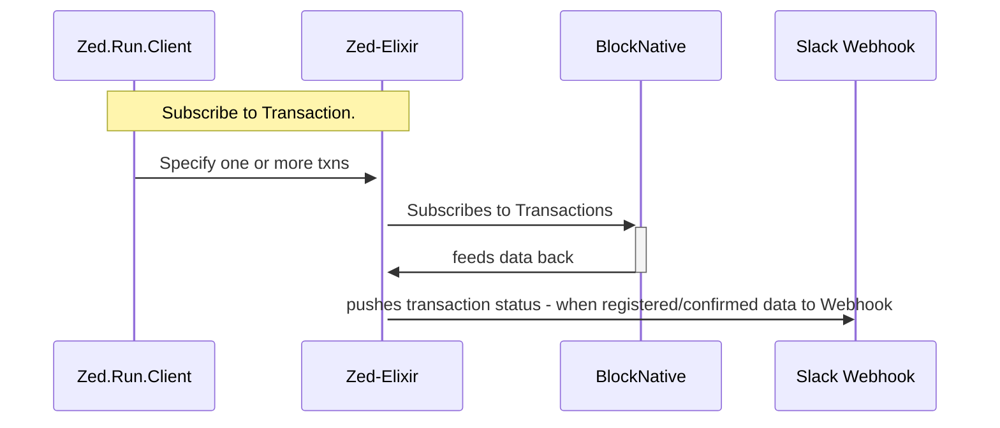

# ZedRunner

## TXN States

```
pending
registered
confirmed
```


@WIP Goal is to build service that accomplishes these tasks

• Surfaces endpoint to receive payload of transaction ids
• Surfaces endpoint that returns json payload of Pending transactions

• Subscribes to updates from BlockNative api for status of specific txn ids

• When state is transaction state is `registered` or `confirmed` payload is sent to webhook (Slack)

• When transaction state is 


