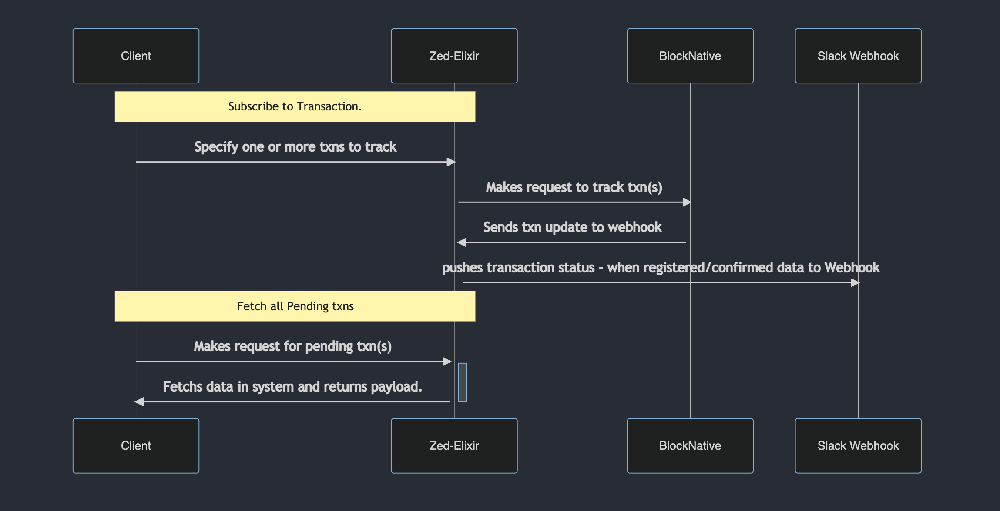

# ZedRunner

# Requirements

You will need a account BlockNative and an API key
https://blocknative.com

You will need a slack webhook endpoint for testing


### Optional dependencies for testing.
___

You will need an an exposed endpoint to your local dev port in order for blocknative to post to your webhook.  
visit https://ngrok.com

## Setup
Clone this repository

Required environment variables

`export BLOCK_NATIVE_API="your block native api key"`
`export SLACK_WEBHOOK='your web hook'`


## Description

@WIP Goal is to build service that accomplishes these tasks

• Surfaces endpoint to receive payload of transaction ids to be tracked by Block Native 

• Surfaces endpoint that returns json payload of Pending transactions

• Subscribes to updates from BlockNative api for status of specific txn ids

• When state is transaction state is `registered` or `confirmed` payload is sent to webhook (Slack)

• When the state of atransaction has been `pending` for more than 2 mins a message is sent to Slack webhook.





### Exposed Endpoints
___
#### Pending transactions

```
curl --location --request POST 'http://593f78412a96.ngrok.io/api/txns/check' \
--header 'Content: application/json'
```

#### TXN Ids to track

```
curl --location --request POST 'http://593f78412a96.ngrok.io/api/txns' \
--header 'Content-Type: application/json' \
--data-raw '{"txn_ids": ["0x73ad333c29b62cd22f360c57d8417bce365667347e1895ff105dbc484631abe4 "]}'
```

Repsponse:

### 